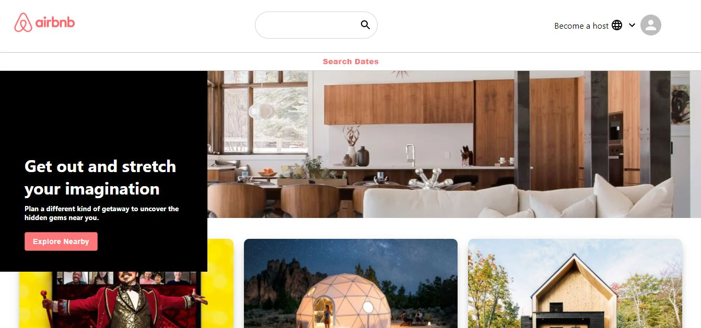

<p align="center"> 
    </img>
</p>

<h1 align="center"> AIRBNB Clone 🔥 </h1> 

<p align="center">
  <a href="https://www.npmjs.com/package/npm/v/6.13.4"></a>
  <a href="https://reactjs.org/"></a>
  <a href="https://material-ui.com/"></a>
  <a href="https://app.netlify.com/sites/akhfas-airbnb-clone/deploys"></a>
</p>

### Clone dan Gunakan 📋

Untuk melihat aplikasi, **[click here](https://akhfas-airbnb-clone.netlify.app/)**

### Aplikasi ini sepenuhnya dibangun dengan `react-js` itulah mengapa kita perlu menginstal `nodejs` dan `npm`.

### Clone repositori ke sistem lokal Anda menggunakan perintah di bawah ini:
  - ```python
     ✔️git clone https://github.com/akhfasarrofi/airbnb-clone.git
    ```
  - Ini akan mengcloning seluruh repositori di sistem Anda.
### Untuk mengunduh dependensi yang diperlukan ke sistem Anda,  jalankan perintah `npm install`
  
### Gunakan perintah `npm start` untuk menjalankan aplikasi
